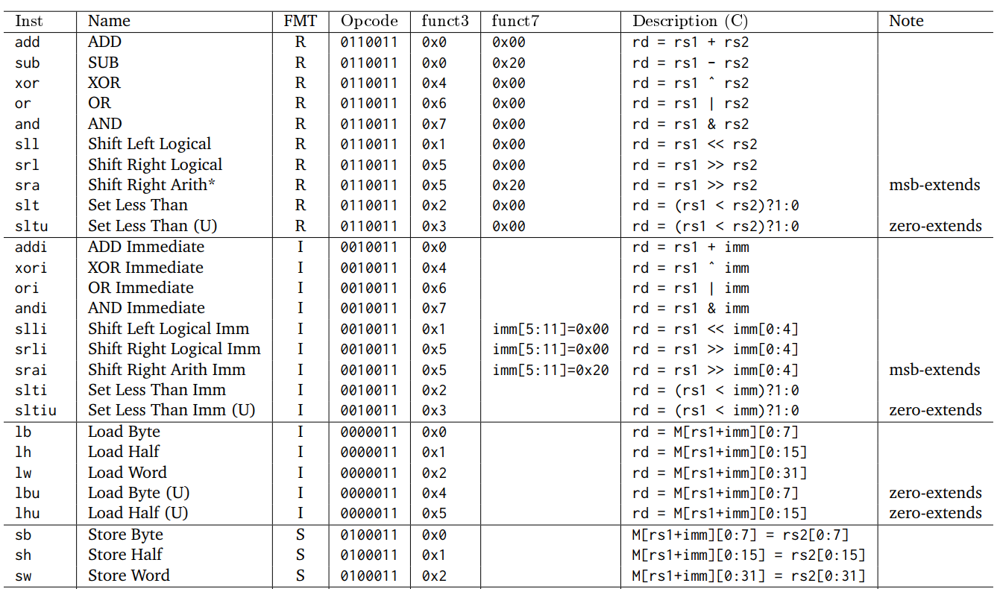
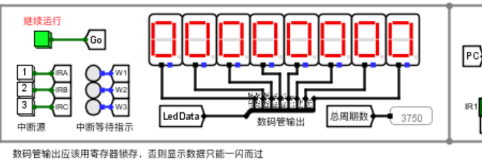
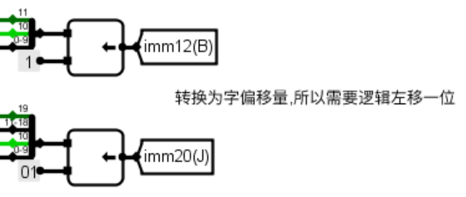
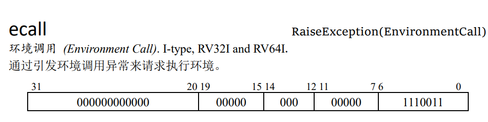
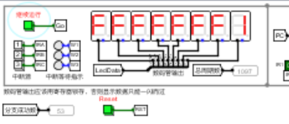

# Computer-Organization-Course-Design

2021级计算机组原课设之硬件综合训练,开始于2023年8月28日，限时两周。

# 在实验中遇到的问题

## 第一关

### 对jalr指令理解不当

根据jalr定义为：rd = PC + (imm<<12) ; PC = rs1 + imm,

结合实际电路图：

会使用到ALU进行计算，故我们应当将AluSrcB置为1，并将AlU_OP置为5。

### 指令的地址通常是以**字节**为单位对齐

不知到指令地址应该以字节为单位对齐，而导致陷入死循环

J型指令中的偏移量需要左移一位，是因为指令的地址通常是以字节为单位对齐的。这意味着指令地址的最低位是0，因为指令的地址是一个连续字节序列中的位置。然而，J型指令的偏移量是以字为单位的。为了实现这种对齐，偏移量通常被存储为字的数量，而不是字节的数量。因此，在进行计算时，需要将字节偏移量转换为字偏移量。

左移一位实际上是将字节偏移量乘以2，以转换为字偏移量。这是因为每个字节包含8位，左移一位相当于乘以2^1（即2），这使得字节偏移量在字对齐的情况下正确转换为字偏移量。

总之，**将J型指令中的偏移量左移一位**是为了正确地将字节偏移量转换为字偏移量，并且在进行跳转时能够正确地定位目标地址。

### ecall不知道如何实现

这里我们首先需要知道ecall是通过引发环境调用异常来请求执行环境。

而对于本题中的ecall，则是调用LED输出寄存器堆中$a0的值

if ($a7==34) LED输出a0的值;else 停机等待Go按键按下

### blt卡在FFFFFFF1(低级错误)

没有正确调用ALU：需要注意，blt的前置条件比较，即`if(rs1<rs2)`中的`rs1`和`rs2`为有符号数。而不同于前面的beq和bne指令，这两者只需要判断`rs1`和`rs2`是否相等即可.而blt需要将ALU_OP置为11(十进制)，即为有符号比较，修改之后blt正确执行。
