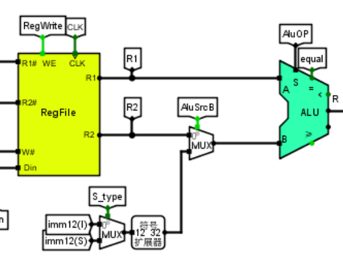
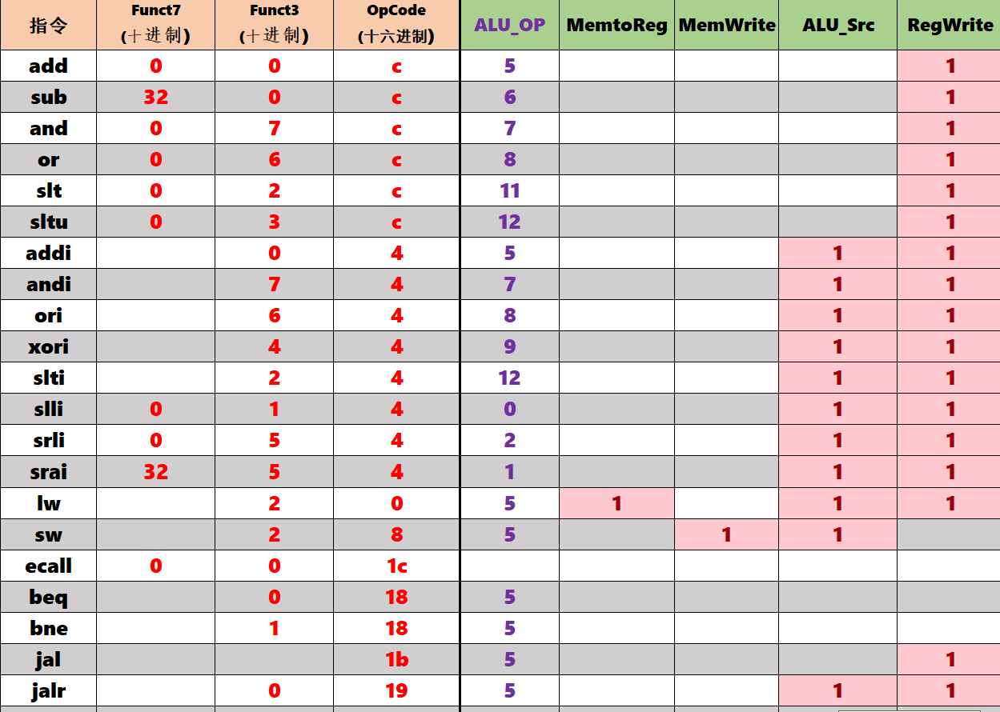
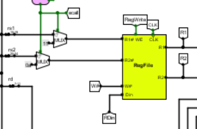
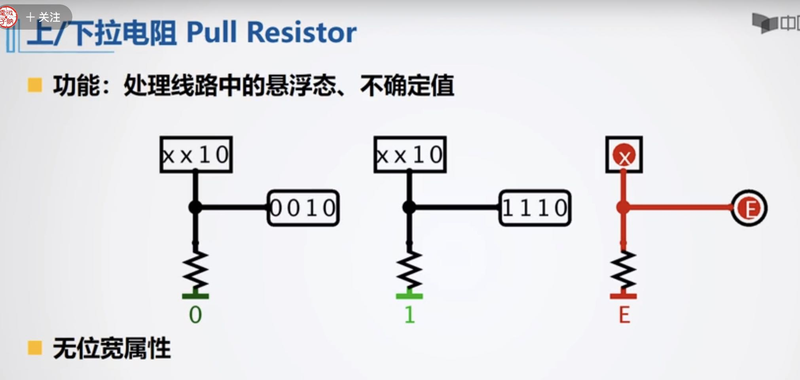

# Computer-Organization-Course-Design

华中科技大学2021级计算机组原课设之硬件综合训练,开始于2023年8月28日。

包含实验的circ文件，和将要发出的FPGA 单周期cpu文件。

# 在实验中遇到的问题以及一些思路

## 单周期CPU设计流程

### 对jalr指令理解不当

根据jalr定义为：rd = PC + (imm<<12) ; PC = rs1 + imm,

结合实际电路图：

会使用到ALU进行计算，故我们应当将AluSrcB置为1，并将AlU_OP置为5。

### 指令的地址通常是以**字节**为单位对齐

不知到指令地址应该以字节为单位对齐，而导致陷入死循环

J型指令中的偏移量需要左移一位，是因为指令的地址通常是以字节为单位对齐的。这意味着指令地址的最低位是0，因为指令的地址是一个连续字节序列中的位置。然而，J型指令的偏移量是以字为单位的。为了实现这种对齐，偏移量通常被存储为字的数量，而不是字节的数量。因此，在进行计算时，需要将字节偏移量转换为字偏移量。

左移一位实际上是将字节偏移量乘以2，以转换为字偏移量。这是因为每个字节包含8位，左移一位相当于乘以2^1（即2），这使得字节偏移量在字对齐的情况下正确转换为字偏移量。

总之，**将J型指令中的偏移量左移一位**是为了正确地将字节偏移量转换为字偏移量，并且在进行跳转时能够正确地定位目标地址。

### ecall不知道如何实现

这里我们首先需要知道ecall是通过引发环境调用异常来请求执行环境。

而对于本题中的ecall，则是调用LED输出寄存器堆中$a0的值

if ($a7==34) LED输出a0的值;else 停机等待Go按键按下

### blt卡在FFFFFFF1(低级错误)

没有正确调用ALU：需要注意，blt的前置条件比较，即`if(rs1<rs2)`中的`rs1`和`rs2`为有符号数。而不同于前面的beq和bne指令，这两者只需要判断`rs1`和`rs2`是否相等即可.而blt需要将ALU_OP置为11(十进制)，即为有符号比较，修改之后blt正确执行。

## 五段流水CPU设计流程

### 理想流水线->气泡流水线->重定向流水线

### 对于理想流水线

理想流水线只需要将单周期CPU的一个周期执行一条指令的基础上，将其划分为5个阶段：

1. IF: Instruction Fetch (指令获取阶段)
2. ID: Instruction Decode (指令解码阶段)
3. EX: Execute (执行阶段)
4. MEM: Memory Access (内存访问阶段)
5. WB: Write Back (写回阶段)

为了分成五个阶段，我们需要在上一阶段和下一阶段之间增加一个时钟周期的延时：每经过一个时钟周期，每个流水级所包含的指令与数据都会流动到下一个流水级，流水线入口灌入一条新的指令，最老的一条指令从出口离开。

将流水寄存器插入到单周期cpu中间的时候，由于要写入RegFile的数据到WB段才能确定，所以**RegWrite**信号也要一路送到WB段，然后和数据RDin，写入地址W#一起通过**反向通路**传输到RegFile的输入端。

### 对于气泡流水线

不同于理想流水线，当指令在流水线中重叠执行时，后面的指令需要用到前面的指令的执行结果，而前面的指令尚未写回导致的冲突，称为数据冒险（也称为**数据相关性**）。

为解决此问题，不妨让后面的指令暂缓一些执行，等到上一条指令完成写回操作时再重新开始执行。

#### 检测必须排除0号寄存器

 注意，**检测必须排除0号寄存器**，因为空指令会被咱们的控制器解读成“`sll $0,$0,$0`”。

下降沿和上升沿

## 中断

### 单周期单级中断

当CPU需要执行一些需要保持一致性的关键操作时，通常会采取以下步骤：

1. **关闭中断**（Disable Interrupts）：在恢复现场或执行其他关键任务之前，CPU会关闭中断，以阻止其他中断请求干扰当前任务。这确保了当前任务能够在不被其他程序或设备打扰的情况下执行。

2. **执行关键任务**：CPU执行需要保持一致性或安全性的关键任务，例如，更新关键数据结构、临界区代码的执行等。

3. **开启中断**（Enable Interrupts）：一旦关键任务完成，CPU可以重新开启中断。这样，其他等待中断处理的程序或设备可以再次发送中断请求，并且CPU会在适当的时候响应这些请求。

这种开关中断的机制有助于确保系统的可靠性和一致性。通过关闭中断，可以防止其他程序的中断请求干扰关键任务的执行，从而避免竞态条件和数据损坏。一旦关键任务完成，再开启中断允许系统响应其他事件和请求。

关中断就是为了让CPU在一段时间内执行同一程序的多条指令而设计的，比如在出现了非常事件后又恢复正常时，CPU就会忙于恢复非常事件出现之前计算机的工作环境（通常叫做恢复现场），在恢复现场的时候，CPU是不允许被其他的程序打扰的，此时就要**启动关中断**，不再响应其他请求。当现场恢复完毕后，CPU就启动开中断，其他等待着的程序的指令就开始被CPU执行，计算机恢复正常。

需要注意的是，关闭中断和开启中断的操作应该谨慎使用，因为关闭中断会导致系统无法响应一些紧急事件，而且过多地使用这些操作可能会降低系统的性能。因此，应该仅在确实需要时使用这些操作，同时要确保它们的使用不会导致系统出现问题。

例如，在此单级中断实验中，下图保护现场开始时，则开启关中断。

而，下图恢复现场后，有uret信号输入时，则同步开中断

### 单周期多级中断

上/下拉电阻Pull Resistor：处理线路中的悬浮态、不确定值，如图：

#### CSRRCI和CSRRSI不需要使用RegWrite
